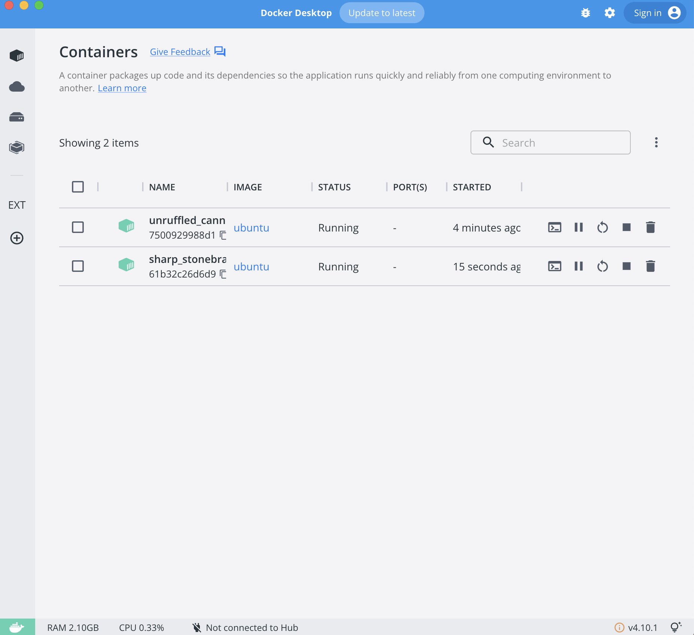
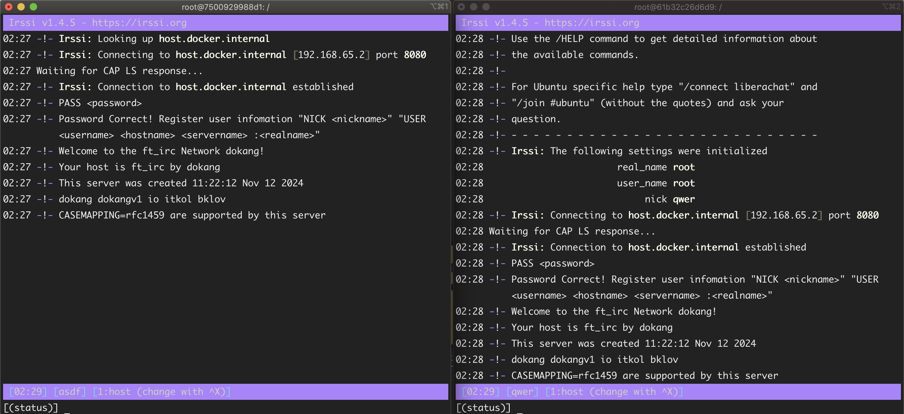
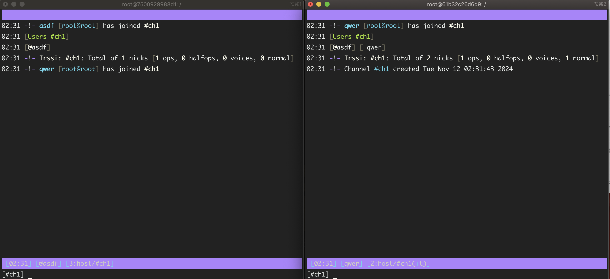
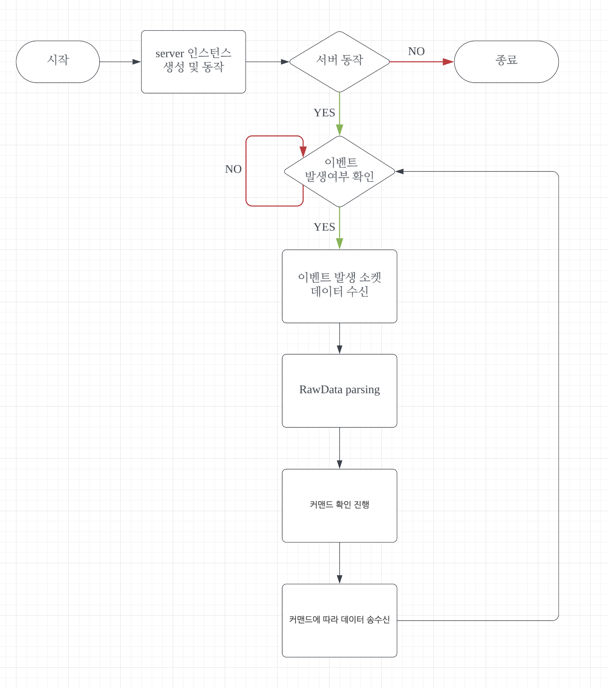

# ft_irc (Team Project)
Internet Relay Chat server.
Team project (2 people)

IRC 서버에 대한 이해, 네트워크, I/O 멀티플렉싱 등 이해하고자 진행한 프로젝트입니다.

---

## 프로젝트 소개
- 소켓을 활용하여 상용 클라이언트들의 동작을 지원하는 서버를 만들자.
- TCP/IP를 통해 LAN 환경 내 클라이언트와 서버의 소통 진행.
- "-std=c++98" 플래그를 사용하여 컴파일.
- 클라이언트는 상용 클라이언트인 `irssi` 사용.

---
## 구현 사항
- 서버 기능으로 소켓 통신을 통해 클라이언트의 연결을 진행
- 클라이언트로부터 받은 raw data 자체를 프로토콜에 의거하여 파싱 처리
- 해당 데이터 요청에 대응
1. 클라이언트 접속(join)에 따른 서버 연결 처리.
2. 클라이언트로부터 받은 privmsg를 다른 클라이언트로 포워딩.
3. 채널의 operator / regular user 구현
4. 채널 명령어 (KICK, INVITE, TOPIC, MODE) 구현
- File transfer 기능 활용

RFC2812: https://datatracker.ietf.org/doc/html/rfc2812
해당 RFC 문서를 참조하여 구현.

---
## 사용법
### server

1. 서버 동작
```c
// repo clone 후,
make
./Ircserv <PORT> <PASSWORD>
```

### 테스트 방식
도커를 활용하여 독립된 환경에서 여러 클라이언트가 접근해보도록 하였음.


각 클라이언트는 `irssi` 상용 irc 클라이언트 활용.

```
irssi -c host.docker.internal -p <Port> -n <Nickname> --password <PASSWORD>
```
8080 포트에 닉네임으로 알맞은 서버 비밀번호를 입력하여 서버에 접속.

도커가 아닌 동일 LAN 상의 별도의 컴퓨터로 접속한다면 `host.docker.internal` 대신 서버 컴퓨터의 IP주소 입력.


각각 클라이언트가 asdf, qwer 닉네임으로 접속한 모습.
이후 `/join ch1` 을 통해 채널에 접속하였다.


---

## 리팩토링

1. write/read -> send/recv 함수로 교체

기존 : 소켓 데이터 송수신에 `write / read` 사용
변경 : `send / recv` 함수로 교체

소켓 프로그래밍에 좀 더 알맞은 입출력 함수로 변경.
변경을 통해 데이터 송수신 시 원하는 플래그 세팅이 가능하다.

기본적인 non-blocking 등 옵션은 fcntl을 통해 미리 설정한 후 진행하였음

2. 서버 -> 클라 메시지 구성에 Builder pattern 적용하기 예정


3. server() 생성자를 싱글톤 구성하기.
싱글톤으로 반드시 구성해야하는 것은 아니나, 

  - 싱글톤으로 구성하므로써 단 하나의 서버 인스턴스만 프로그램에 존재하도록 설정하였고,
  - 타 클래스에서 서버의 정보가 필요할 경우 static이 전역 객체처럼 쓰이는 특성을 활용하여 접근성을 용이하게 높임

static 함수 내에 정적 객체로 서버를 선언해주었고, 정적 지역 객체는 초기에 한 번 초기화되는 속성을 활용하여 단일 인스턴스로 존재하도록 하였음.


---

## simple flowChart
